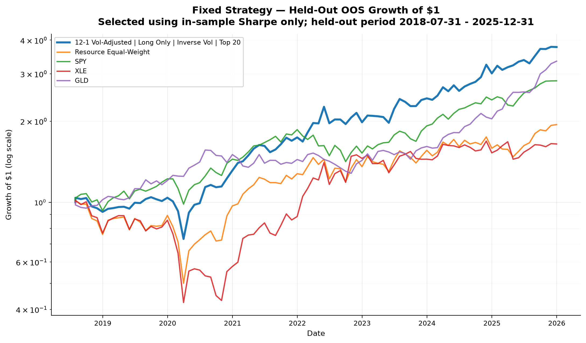

# Natural Resource Momentum Backtest

## Overview

This repository tests cross-sectional momentum strategies across natural-resource equities, including energy, metals and mining, chemicals, forestry, and construction materials. The initial static approach uses monthly Yahoo Finance data and a hand-curated ticker universe. The primary dynamic approach reconstructs the historical investable universe using CRSP data, with point-in-time market capitalization, liquidity, industry classification, ticker changes, and delisted securities. The project compares multiple momentum signals and portfolio constructions using held-out out-of-sample testing and walk-forward robustness analysis.

## Research Question

The core question is whether momentum signals can identify persistent relative strength within natural-resource equities, and whether that result survives different portfolio constructions and validation checks.

## Initial Hypothesis

I believed momentum would be especially strong in natural-resource equities because industries like oil, gas, and mining are heavily influenced by news, geopolitical events, commodity-price moves, and investor sentiment. I expected those forces to create large waves and persistent trends rather than isolated price movements. Because momentum strategies try to capture those trends, I thought natural-resource equities would be a particularly strong place to test whether momentum actually works.

## Strategy Framework

The backtest builds monthly cross-sectional strategies. Each month, stocks receive a signal score, eligible stocks are ranked, and portfolios are formed from selected names. The grid varies signal family, window, strategy type, selection count, weighting, and optional maximum position caps.

Top-N variants test `top10`, `top20`, and `top30`. Scaled variants test caps of 25%, 20%, and 15%. Total gross exposure is 1.0: 100% long for long-only portfolios, or 50% long and 50% short for classic long/short portfolios.

## Momentum Signals

Signal code lives in `strats/momentum_signals.py` and is called through `strats/builder.py`. Raw momentum is calculated from the monthly signal price series: Yahoo adjusted close in static mode, and a CRSP total-return index compounded from `MthRet` in dynamic mode. It measures the return from a prior starting price to a more recent ending price, with a skip month. Implemented raw windows are `3-1`, `6-1`, `12-1`, and `18-1`.

Volatility-adjusted momentum divides raw momentum by trailing monthly return volatility. The implemented volatility lookback is 6 months.

The project also implements simple, exponential, and linearly weighted moving-average crossover signals. Prices are shifted before calculating moving averages. Crossover windows are `3-12`, `6-12`, and `6-18`; each score is fast average divided by slow average minus one.

## Key Strategy Concepts

### Volatility-Adjusted Momentum

Volatility-adjusted momentum changes the ranking signal. It asks whether a stock's momentum was strong relative to the volatility it took to produce that momentum.

For stock $i$ at month $t$, raw momentum is:

$$M_{i,t} = \frac{P_{i,t-s} - P_{i,t-L}}{P_{i,t-L}}$$

where:

- $L$ is the full lookback window
- $s$ is the skip-month offset
- $P_{i,t-s}$ is the more recent price used in the momentum calculation
- $P_{i,t-L}$ is the starting price used in the momentum calculation

For example, `12-1` momentum compares the price from one month ago with the price from twelve months ago.

Volatility-adjusted momentum divides that raw momentum by trailing realized volatility:

$$S_{i,t} = \frac{M_{i,t}}{\sigma_{i,t}}$$

where $\sigma_{i,t}$ is calculated from trailing monthly returns available before the portfolio month.

In plain English, this rewards stocks that produced strong momentum with a smoother return path. Two stocks may both be up 30%, but the one that got there with lower volatility receives the higher volatility-adjusted score.

This affects **which stocks are selected**. It does not directly determine portfolio weights.

### Inverse-Volatility Weighting

Inverse-volatility weighting is a portfolio sizing rule applied after the stocks have already been selected.

For each selected stock, trailing realized volatility is calculated using only prior monthly returns. The raw inverse-volatility weight is:

$$\tilde{w}_{i,t} = \frac{1}{\sigma_{i,t}}$$

The raw weights are then normalized:

$$w_{i,t} = \frac{\tilde{w}_{i,t}}{\sum_{j \in S_t}\tilde{w}_{j,t}}$$

where $S_t$ is the selected set of stocks.

This gives larger weights to lower-volatility selected stocks and smaller weights to higher-volatility selected stocks, while keeping total gross exposure fixed.

Missing, zero, or invalid volatility values are not filled with artificial estimates. Those stocks do not receive inverse-volatility weights for that month, and the remaining valid selected names are renormalized.

The distinction is important:

- **volatility-adjusted momentum** determines which stocks are selected
- **inverse-volatility weighting** determines how much capital selected stocks receive

The current primary fixed OOS strategy uses both:

```text
voladj6_12-1 | long_only | inverse_vol | top20
```

That means it ranks stocks by `12-1` volatility-adjusted momentum, selects the top 20, and then sizes those selected positions using inverse-volatility weights.

## Portfolio Construction

Portfolio construction is split across `strats/long_only.py`, `strats/long_short.py`, `strats/long_short_abs.py`, `strats/threshold_momentum.py`, and `strats/weights.py`. Implemented types:

- Long-only: long the top-ranked stocks by signal score.
- Classic long-short: long the strongest momentum names and short the weakest momentum names.
- Directional absolute momentum: rank stocks by absolute signal value, then use signal sign to decide long or short.
- Threshold momentum: hold stocks whose raw momentum is strictly greater than a threshold.

Threshold strategies are long-only and equal-weighted. They use raw momentum windows with thresholds of 0%, 20%, and 50%. Unlike Top-N strategies, they may hold a variable number of stocks. If no stocks pass, the strategy records a 0% return for that month.

Equal-weight portfolios assign the same weight to each selected position. Scaled portfolios allocate more weight to stronger signals. Long-only scaling shifts selected scores and normalizes them; classic long-short scaling normalizes each side separately; directional absolute scaling weights larger absolute signals more heavily. When `max_weight` is supplied, individual weights are capped and remaining exposure is redistributed.

## Universe Construction

The project supports static and dynamic universe modes.

### Static Universe

The static universe was the initial pass at defining the natural-resource equity universe. It uses the hand-curated `NATURAL_RESOURCE_TICKERS` list in `universe/static.py` and does not attempt historical reconstitution. Because the list is based on currently known tickers, results from static mode are subject to survivorship bias and are retained mainly as a baseline for comparison with the dynamic universe.

### Dynamic Universe

Dynamic mode is the primary research universe used in the backtest. Unlike the initial static approach, it uses historical CRSP data to reconstruct the natural-resource equity universe through time. Securities are tracked internally by PERMNO, while ticker symbols are used only for display.

The dynamic process currently does the following:

- starts from CRSP historical securities in the supplied broad daily candidate file
- applies point-in-time resource classification from CRSP `names.csv.gz` effective dates and historical SIC/NAICS codes
- reconstitutes the eligible universe once per year, labeled on January 1
- uses data strictly before the reconstitution date
- uses latest CRSP monthly `MthCap` before reconstitution for the $1 billion market-cap screen
- calculates trailing average daily dollar volume from CRSP daily `abs(DlyPrc) * DlyVol` over a 60-trading-day lookback
- requires at least 40 valid liquidity observations
- applies a $5 million average daily dollar volume threshold
- targets a minimum annual universe size of 60 names
- includes all names above the normal liquidity threshold
- adds the most liquid below-threshold valid names only if needed to reach the minimum universe target
- applies no arbitrary maximum annual universe size

Dynamic-mode stock returns use CRSP monthly `MthRet`. Signal price inputs use a total-return index compounded from `MthRet`, not raw CRSP price and not Yahoo adjusted prices.

## Backtest Methodology

Static mode uses Yahoo Finance adjusted close data starting from `2000-01-01`. Prices are resampled to month-end, and monthly returns are calculated from month-end adjusted prices. The run script excludes the current partial month.

Dynamic mode uses CRSP monthly equity data through the last complete available CRSP month. The current supplied CRSP files run through `2025-12-31`, so dynamic stock-strategy results stop there rather than mixing in 2026 Yahoo equity data.

Signals are calculated on monthly prices. Momentum and moving-average inputs are shifted by the configured skip month before portfolio formation, so the same month being traded is not used for ranking. In dynamic mode, annual universe membership controls eligibility; signals may still be calculated from full price history, but ineligible names are masked out before selection.

The strategy grid is evaluated for reporting over the full available sample and compared with benchmark ETF returns, but the primary validation result is based on the 70/30 out-of-sample test. The code also calculates an equal-weight resource-universe return.

## Validation Framework

Validation logic is implemented in `backtest/validation.py`. The project uses two complementary validation approaches that answer different questions.

### Primary: 70/30 Fixed-Strategy Out-of-Sample Test

The primary validation test asks: if a strategy specification is selected using only the first 70% of valid strategy history, does that exact fixed specification continue to perform in the untouched final 30%?

The first 70% of valid monthly strategy-return history is used as the in-sample period. Strategies need at least 36 valid monthly returns before ranking. The best specification is selected using in-sample Sharpe ratio, then frozen. The final 30% is held out for evaluation, with no re-selection during that out-of-sample period.

In current dynamic CRSP mode, the fixed strategy selected using only the in-sample period is:

```text
voladj6_12-1 | long_only | inverse_vol | top20
```



**Held-Out Out-of-Sample Performance (2018-07-31 to 2025-12-31).** The fixed strategy was selected using in-sample Sharpe over 2001-01-31 to 2018-06-30 and then evaluated on the held-out period without re-selection.

Headline primary OOS result: selected strategy `voladj6_12-1 | long_only | inverse_vol | top20`; annualized return 20.41%; Sharpe ratio 0.958; final value of $1 approximately $4.03.

The held-out OOS period is `2018-07-31` through `2025-12-31`. This fixed specification produced approximately:

- annualized return: 20.41%
- annualized volatility: 21.96%
- Sharpe ratio: 0.958
- maximum drawdown: -30.16%
- Calmar ratio: 0.677

Over the identical OOS dates, SPY produced approximately:

- annualized return: 14.85%
- annualized volatility: 16.75%
- Sharpe ratio: 0.914
- maximum drawdown: -23.93%
- Calmar ratio: 0.620

This 70/30 fixed-strategy test is the primary test of whether the identified momentum specification generalized to unseen data.

### Secondary: Walk-Forward Robustness Analysis

The walk-forward analysis asks a different question: if the model-selection process is repeated through time, is it stable across regimes?

Walk-forward validation uses a trailing 120-month training window and a 12-month test window. At each annual decision date, strategies are ranked using past data only. The selected strategy, or experimental ensemble of selected strategies, is then traded for the following 12 months. The process repeats annually and concatenates the out-of-sample test segments.

The single-winner walk-forward selector repeatedly chooses the highest trailing-Sharpe strategy. This is a harder robustness test of the selection process, not the primary proposed fixed strategy. Current dynamic CRSP results show that the single-winner selection process is unstable. Top-3, Top-5, and diversified Top-5 ensembles improve walk-forward robustness, but they still do not outperform SPY over the full `2011-01-31` through `2025-12-31` walk-forward period.

### Walk-Forward Ensembles

The walk-forward ensemble tests are secondary robustness checks. They do not replace the primary fixed 70/30 OOS strategy.

At each annual walk-forward rebalance, the code ranks strategies using only the trailing 120 months of training data.

The Top-3 and Top-5 ensembles select the highest-training-Sharpe strategies and combine their next-12-month returns using equal allocation:

$$R_t^{\mathrm{ensemble}} = \frac{1}{N}\sum_{k=1}^{N}R_{k,t}^{\mathrm{strategy}}$$

where $N$ is 3 or 5.

The diversified Top-5 ensemble adds a simple diversification rule. Strategies are grouped by:

- signal family
- strategy type
- weighting method

The algorithm walks down the training-Sharpe ranking and prefers the highest-ranked strategy from distinct groups until five strategies have been selected. If fewer than five distinct groups are available, it fills the remaining slots with the next highest-ranked valid strategies.

This is designed to avoid selecting five nearly identical variants of the same model. It does not use future correlations, optimized weights, machine learning, or out-of-sample performance.

## Benchmarks

The benchmark ETF tickers used by the project are `SPY`, `XLE`, `XLB`, `XME`, `GDX`, `GLD`, `USO`, and `DBC`.

Relative metrics are currently calculated against `SPY`, `XLE`, `XLB`, `GLD`, and `DBC` when available.

The code also downloads commodity futures: `GC=F`, `SI=F`, `HG=F`, `CL=F`, `BZ=F`, `NG=F`, `ZC=F`, `ZW=F`, and `ZS=F`.

## Performance Metrics

The current metrics include:

- number of monthly periods
- cumulative return
- annualized return
- annualized volatility
- Sharpe ratio
- maximum drawdown
- Calmar ratio
- win rate
- final portfolio value
- beta to selected benchmarks
- alpha to selected benchmarks
- correlation to selected benchmarks
- information ratio to selected benchmarks

Annualized return is calculated from compounded monthly returns. Sharpe uses a zero risk-free rate. Calmar is annualized return divided by the absolute value of maximum drawdown.

## Current Findings

The strongest fixed specification selected using the initial training sample was 12-1 volatility-adjusted momentum with inverse-volatility weighting. It generalized strongly over the held-out `2018-07-31` through `2025-12-31` sample, outperforming the resource equal-weight benchmark and SPY on annualized return and slightly outperforming SPY on Sharpe.

However, a separate rolling walk-forward analysis showed that repeatedly selecting the single best historical specification was considerably less stable. Ensembles of several highly ranked strategies reduced this model-selection risk, but the walk-forward process still underperformed SPY over the longer `2011-01-31` through `2025-12-31` period.

The results support the existence of useful momentum stock-selection effects within natural-resource equities, while also showing that dynamically identifying the best specification through time is difficult. The full-sample winner is descriptive only and should not be treated as unbiased out-of-sample evidence.

## Project Structure

```text
.
├── main.py
├── backtest/
│   ├── data_download.py
│   ├── config.py
│   ├── metrics.py
│   ├── reporting.py
│   ├── universe_setup.py
│   └── validation.py
├── strats/
│   ├── builder.py
│   ├── grid.py
│   ├── long_only.py
│   ├── long_short.py
│   ├── long_short_abs.py
│   ├── momentum_signals.py
│   ├── portfolio.py
│   ├── threshold_momentum.py
│   └── weights.py
└── universe/
    ├── crsp/
    │   ├── __init__.py
    │   ├── construction.py
    │   ├── data.py
    │   └── integration.py
    ├── diagnostics.py
    ├── dynamic.py
    ├── historical_data.py
    ├── resource_classification.py
    └── static.py
```

`main.py` is the project-level entry point where universe construction, data preparation, strategy generation, portfolio construction, backtesting, validation, benchmarking, reporting, and plotting are orchestrated together. `backtest/` contains configuration, data download, metrics, reporting, validation, and backtesting infrastructure. `strats/` contains signals, strategy-grid construction, selection, weighting, and return calculation. `universe/` contains the static ticker list, CRSP loaders, resource classification, and dynamic annual universe logic.

## Running the Backtest

Dynamic CRSP mode is the default and can be run directly:

```bash
python main.py
```

Static mode can be run with:

```bash
UNIVERSE_MODE=static python main.py
```

No-plots mode can be run with:

```bash
SHOW_PLOTS=0 python main.py
```

Static no-plots mode can be run with:

```bash
UNIVERSE_MODE=static SHOW_PLOTS=0 python main.py
```

Set `UNIVERSE_MODE` to `"static"` for the hand-curated ticker list or `"dynamic"` to build annual CRSP-based eligibility tables. With `SHOW_PLOTS=1`, `main.py` first displays the fixed-strategy held-out OOS performance chart, then Sharpe diagnostics, then the separate walk-forward robustness chart and dynamic-universe viewer.

## Data Sources

Static resource equities, benchmark ETFs, and commodity futures use Yahoo Finance adjusted close prices.

Dynamic resource equities use CRSP files from `CRSP_DATA_DIR` in `backtest/config.py`:

- `monthly_stock.csv.gz`
- `names.csv.gz`
- `delistings.csv.gz`
- `daily_stock.csv.gz`

Dynamic mode still uses Yahoo where useful for external benchmark ETFs and commodity futures. It does not use Yahoo prices, Yahoo current screeners, or Yahoo historical shares for CRSP dynamic-universe stocks.

## Current Limitations

The static universe is hand-curated and survivorship-biased.

Dynamic mode depends on the local CRSP extract. The supplied daily file is a broad historical resource-candidate pool, so a security absent from that daily extract cannot pass the 60-day liquidity screen even if it appears in the full monthly CRSP file.

The backtest does not model transaction costs, slippage, bid/ask spreads, market impact, borrow costs, financing costs, taxes, or turnover constraints. Long/short returns are calculated directly from signed monthly weights and asset returns. 

## Future Improvements

Likely next steps include adding transaction costs, slippage, short borrow costs, financing rates, turnover reporting, and more explicit CRSP extract metadata/version tracking.
